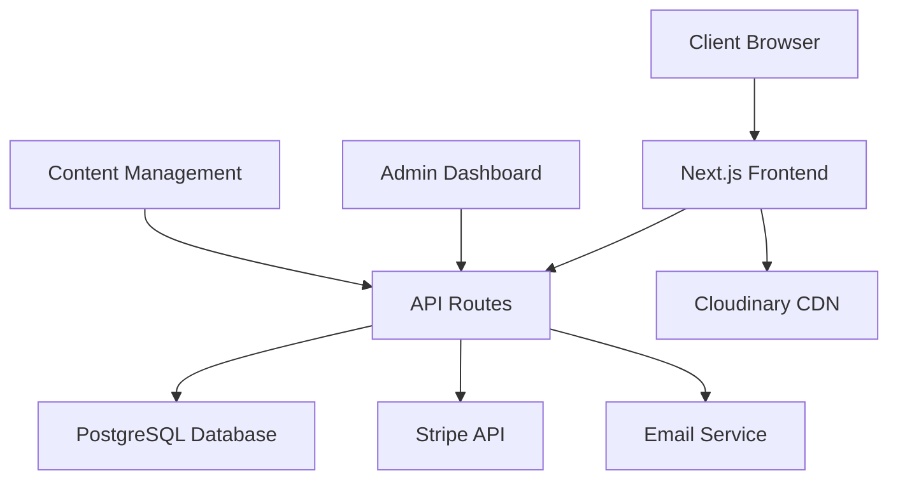

# Design Document: Mystic Tarot & Gems Website

## Overview

The Mystic Tarot & Gems website is a premium AI-powered spiritual services platform that seamlessly integrates tarot reading services with an e-commerce gem shop. This design document outlines the technical architecture, UI/UX specifications, and implementation approach for building a modern, responsive website that embodies luxury mystical aesthetics while delivering exceptional user experience and conversion optimization.

### Core Objectives

- Create a premium mystical brand experience that builds trust and credibility
- Implement responsive design optimized for mobile-first user engagement
- Develop scalable e-commerce functionality for gem sales
- Build efficient appointment booking system for tarot reading services
- Ensure fast loading times and SEO optimization
- Establish content management capabilities for ongoing blog and product updates

### Target Audience

- Primary: Individuals seeking spiritual guidance and mystical experiences (ages 25-55)
- Secondary: Healing crystal enthusiasts and collectors
- Tertiary: Content consumers interested in astrology, tarot, and spiritual wellness

## Architecture

### Technology Stack

**Frontend Framework**: Next.js 14 with TypeScript

- Server-side rendering for SEO optimization
- Built-in performance optimizations
- Excellent developer experience and ecosystem
- Strong TypeScript support for maintainable code

**Styling**: Tailwind CSS with custom design system

- Utility-first approach for rapid development
- Custom color palette for mystical theme
- Responsive design utilities
- Animation and transition utilities

**State Management**: Zustand

- Lightweight and performant
- Simple API for cart and booking state
- TypeScript-first design
- Minimal boilerplate

**Database**: PostgreSQL with Prisma ORM

- Robust relational database for complex e-commerce data
- Excellent performance and scalability
- Strong ACID compliance for financial transactions
- Prisma provides type-safe database access

**Authentication**: NextAuth.js

- Secure authentication with multiple providers
- Session management
- Role-based access control for admin features

**Payment Processing**: Stripe

- Secure payment handling
- International payment support
- Subscription capabilities for future services
- Comprehensive webhook system

**Image Management**: Cloudinary

- Optimized image delivery
- Automatic format conversion
- Responsive image generation
- CDN distribution

**Deployment**: Vercel

- Seamless Next.js integration
- Global CDN
- Automatic deployments
- Edge functions support

### System Architecture



### Performance Strategy

- **Code Splitting**: Automatic route-based code splitting with Next.js
- **Image Optimization**: Next.js Image component with Cloudinary integration
- **Caching**: Redis for session storage and frequently accessed data
- **CDN**: Global content delivery through Vercel Edge Network
- **Bundle Optimization**: Tree shaking and dynamic imports for third-party libraries

## Components and Interfaces

### Component Architecture

**Design System Components**:

- `Button` - Mystical-themed buttons with glow effects
- `Card` - Glassmorphism cards for products and services
- `Input` - Form inputs with mystical styling
- `Modal` - Overlay components for booking and cart
- `Navigation` - Sticky header with smooth animations
- `Footer` - Links and social media integration

**Page Components**:

- `HomePage` - Hero section, featured products, testimonials
- `ServicesPage` - Tarot reading types and pricing
- `ShopPage` - E-commerce gem catalog with filtering
- `BookingPage` - Appointment scheduling interface
- `BlogPage` - Content management and article display
- `AboutPage` - Brand story and mission
- `ContactPage` - Contact form and business information

**Feature Components**:

- `ProductGrid` - Responsive gem display with cart integration
- `BookingForm` - Multi-step appointment scheduling
- `ShoppingCart` - Cart management with quantity controls
- `TestimonialCarousel` - Customer review slider
- `AnimatedBackground` - Mystical particle effects
- `LoadingSpinner` - Branded loading animations

### UI/UX Design Patterns

**Color Palette**:

```css
:root {
  --primary-purple: #4c1d95;
  --deep-purple: #2d1b69;
  --accent-gold: #f59e0b;
  --mystical-black: #0f0f23;
  --glass-white: rgba(255, 255, 255, 0.1);
  --neon-glow: #8b5cf6;
}
```

**Typography Scale**:

- Headings: "Cinzel" (elegant serif)
- Subheadings: "Dancing Script" (mystical handwritten)
- Body: "Inter" (clean sans-serif)
- Accent: "Playfair Display" (luxury serif)

**Animation Specifications**:

- Page transitions: 300ms ease-in-out
- Hover effects: 200ms ease-out with glow expansion
- Loading animations: Pulsing mystical symbols
- Scroll animations: Fade-in with 100ms stagger
- Parallax: Subtle 0.5x speed background movement

**Glassmorphism Effects**:

```css
.glass-card {
  background: rgba(255, 255, 255, 0.1);
  backdrop-filter: blur(10px);
  border: 1px solid rgba(255, 255, 255, 0.2);
  border-radius: 16px;
  box-shadow: 0 8px 32px rgba(0, 0, 0, 0.3);
}
```

### Responsive Design Breakpoints

- Mobile: 320px - 767px (single column, touch-optimized)
- Tablet: 768px - 1023px (two-column grid, hybrid navigation)
- Desktop: 1024px+ (multi-column layouts, hover interactions)

**Mobile-First Approach**:

- Touch-friendly button sizes (minimum 44px)
- Simplified navigation with hamburger menu
- Optimized image sizes for mobile bandwidth
- Swipe gestures for product carousels

## Data Models

### Database Schema

**Users Table**:

```sql
CREATE TABLE users (
  id UUID PRIMARY KEY DEFAULT gen_random_uuid(),
  email VARCHAR(255) UNIQUE NOT NULL,
  name VARCHAR(255) NOT NULL,
  phone VARCHAR(20),
  created_at TIMESTAMP DEFAULT NOW(),
  updated_at TIMESTAMP DEFAULT NOW()
);
```

**Products Table**:

```sql
CREATE TABLE products (
  id UUID PRIMARY KEY DEFAULT gen_random_uuid(),
  name VARCHAR(255) NOT NULL,
  description TEXT,
  price DECIMAL(10,2) NOT NULL,
  image_url VARCHAR(500),
  category VARCHAR(100),
  properties JSONB, -- Crystal properties and metaphysical attributes
  stock_quantity INTEGER DEFAULT 0,
  is_active BOOLEAN DEFAULT true,
  created_at TIMESTAMP DEFAULT NOW(),
  updated_at TIMESTAMP DEFAULT NOW()
);
```

**Appointments Table**:

```sql
CREATE TABLE appointments (
  id UUID PRIMARY KEY DEFAULT gen_random_uuid(),
  user_id UUID REFERENCES users(id),
  reading_type VARCHAR(100) NOT NULL,
  scheduled_date TIMESTAMP NOT NULL,
  status VARCHAR(50) DEFAULT 'pending',
  message TEXT,
  price DECIMAL(10,2) NOT NULL,
  created_at TIMESTAMP DEFAULT NOW(),
  updated_at TIMESTAMP DEFAULT NOW()
);
```

**Orders Table**:

```sql
CREATE TABLE orders (
  id UUID PRIMARY KEY DEFAULT gen_random_uuid(),
  user_id UUID REFERENCES users(id),
  total_amount DECIMAL(10,2) NOT NULL,
  status VARCHAR(50) DEFAULT 'pending',
  stripe_payment_id VARCHAR(255),
  shipping_address JSONB,
  created_at TIMESTAMP DEFAULT NOW(),
  updated_at TIMESTAMP DEFAULT NOW()
);
```

**Order Items Table**:

```sql
CREATE TABLE order_items (
  id UUID PRIMARY KEY DEFAULT gen_random_uuid(),
  order_id UUID REFERENCES orders(id),
  product_id UUID REFERENCES products(id),
  quantity INTEGER NOT NULL,
  unit_price DECIMAL(10,2) NOT NULL,
  created_at TIMESTAMP DEFAULT NOW()
);
```

**Blog Posts Table**:

```sql
CREATE TABLE blog_posts (
  id UUID PRIMARY KEY DEFAULT gen_random_uuid(),
  title VARCHAR(255) NOT NULL,
  slug VARCHAR(255) UNIQUE NOT NULL,
  content TEXT NOT NULL,
  excerpt TEXT,
  featured_image VARCHAR(500),
  category VARCHAR(100),
  tags TEXT[],
  is_published BOOLEAN DEFAULT false,
  published_at TIMESTAMP,
  created_at TIMESTAMP DEFAULT NOW(),
  updated_at TIMESTAMP DEFAULT NOW()
);
```

### API Endpoints

**Authentication**:

- `POST /api/auth/signin` - User login
- `POST /api/auth/signup` - User registration
- `POST /api/auth/signout` - User logout

**Products**:

- `GET /api/products` - List products with filtering
- `GET /api/products/[id]` - Get product details
- `POST /api/products` - Create product (admin)
- `PUT /api/products/[id]` - Update product (admin)

**Cart & Orders**:

- `POST /api/cart/add` - Add item to cart
- `PUT /api/cart/update` - Update cart quantities
- `DELETE /api/cart/remove` - Remove cart item
- `POST /api/orders` - Create order
- `GET /api/orders/[id]` - Get order details

**Appointments**:

- `POST /api/appointments` - Book appointment
- `GET /api/appointments` - List user appointments
- `PUT /api/appointments/[id]` - Update appointment
- `DELETE /api/appointments/[id]` - Cancel appointment

**Blog**:

- `GET /api/blog` - List published posts
- `GET /api/blog/[slug]` - Get post by slug
- `POST /api/blog` - Create post (admin)
- `PUT /api/blog/[id]` - Update post (admin)

## Correctness Properties

_A property is a characteristic or behavior that should hold true across all valid executions of a system-essentially, a formal statement about what the system should do. Properties serve as the bridge between human-readable specifications and machine-verifiable correctness guarantees._

### Property 1: Brand Name Consistency

_For any_ page on the website, the brand name "Mystic Tarot & Gems" should be prominently displayed in the header or navigation area.

**Validates: Requirements 1.1**

### Property 2: Color Scheme Consistency

_For any_ component or page element, the computed CSS colors should match the defined mystical color palette (deep purple, black, gold accents).

**Validates: Requirements 1.2**

### Property 3: Typography Consistency

_For any_ text element, the font family should match the design system specification (serif for body, handwritten for headings).

**Validates: Requirements 1.3**

### Property 4: Mystical Imagery Presence

_For any_ page that should contain mystical elements, appropriate imagery (tarot cards, crystals, astrology symbols) should be present in the DOM.

**Validates: Requirements 1.4**

### Property 5: Visual Effects Implementation

_For any_ interactive element, glassmorphism or glow effects should be applied through appropriate CSS properties (backdrop-filter, box-shadow).

**Validates: Requirements 1.5**

### Property 6: Dark Theme Consistency

_For any_ page or component, the background colors and text colors should follow dark theme patterns throughout the interface.

**Validates: Requirements 1.6**

### Property 7: Responsive Layout Behavior

_For any_ viewport width (mobile, tablet, desktop), the layout should adapt appropriately without horizontal scrolling or broken elements.

**Validates: Requirements 2.1**

### Property 8: Page Load Performance

_For any_ page request, the initial page load should complete within the 3-second performance threshold.

**Validates: Requirements 2.2**

### Property 9: Cross-Device Visual Consistency

_For any_ key visual element, its relative positioning and styling should remain consistent across different device types.

**Validates: Requirements 2.3**

### Property 10: Asset Optimization

_For any_ image or asset, it should be served in optimized formats with appropriate compression and sizing.

**Validates: Requirements 2.4**

### Property 11: SEO Structure Implementation

_For any_ page, proper meta tags, structured data, and semantic HTML should be present for SEO optimization.

**Validates: Requirements 2.5**

### Property 12: Background Animation Effects

_For any_ page with mystical background effects, CSS animations or JavaScript animations should be active and visible.

**Validates: Requirements 3.2**

### Property 13: Navigation Button Functionality

_For any_ call-to-action button click, the navigation should redirect to the correct target page or section.

**Validates: Requirements 3.4, 3.5**

### Property 14: Service Introduction Content

_For any_ hero section, introductory text about the services offered should be present and visible.

**Validates: Requirements 3.6**

### Property 15: Sticky Navigation Behavior

_For any_ scroll position on a page, the navigation bar should remain visible and properly positioned.

**Validates: Requirements 4.1**

### Property 16: Smooth Scrolling Implementation

_For any_ internal page navigation, smooth scrolling behavior should be implemented via CSS or JavaScript.

**Validates: Requirements 4.2**

### Property 17: Button Hover Effects

_For any_ interactive button, hover states should trigger glow or gradient animation effects.

**Validates: Requirements 4.3**

### Property 18: Interface Transition Animations

_For any_ interactive element state change, smooth fade or transition animations should be applied.

**Validates: Requirements 4.4**

### Property 19: Slider Navigation Controls

_For any_ carousel or slider component, appropriate navigation arrows should be present and functional.

**Validates: Requirements 4.5**

### Property 20: Footer Content Completeness

_For any_ page footer, quick links and social media icons should be present and properly linked.

**Validates: Requirements 4.6**

### Property 21: Reading Service Pricing Display

_For any_ reading type service, associated pricing information should be displayed alongside the service description.

**Validates: Requirements 5.2**

### Property 22: Service Booking Button Presence

_For any_ reading service listing, a "Book Appointment" button should be present and functional.

**Validates: Requirements 5.3**

### Property 23: Booking Navigation Functionality

_For any_ "Book Appointment" button click, navigation should redirect to the booking form page.

**Validates: Requirements 5.4**

### Property 24: Service Description Completeness

_For any_ reading type, detailed descriptive content should be present and visible to users.

**Validates: Requirements 5.5**

### Property 25: Date Time Selection Functionality

_For any_ booking form, date and time input elements should be present and allow user selection.

**Validates: Requirements 6.2**

### Property 26: Reading Type Selection

_For any_ booking form, a dropdown or selection element for reading types should be available.

**Validates: Requirements 6.3**

### Property 27: Message Input Availability

_For any_ booking form, a text area for additional messages or concerns should be present.

**Validates: Requirements 6.4**

### Property 28: Booking Confirmation Display

_For any_ successful booking form submission, a confirmation message should be displayed to the user.

**Validates: Requirements 6.5**

### Property 29: Form Validation Implementation

_For any_ required form field that is empty, form submission should be prevented and validation messages displayed.

**Validates: Requirements 6.6**

### Property 30: Product Grid Layout

_For any_ e-commerce product display, items should be arranged in a CSS grid layout with associated product images.

**Validates: Requirements 7.1**

### Property 31: Product Information Display

_For any_ gem product, price and description information should be visible alongside the product image.

**Validates: Requirements 7.3**

### Property 32: Add to Cart Button Presence

_For any_ product listing, an "Add to Cart" button should be present and associated with the correct product.

**Validates: Requirements 7.4**

### Property 33: Cart Addition Functionality

_For any_ "Add to Cart" button click, the item should be successfully added to the shopping cart state.

**Validates: Requirements 7.5**

### Property 34: Shopping Cart Management

_For any_ cart interaction, users should be able to update quantities, remove items, and view cart totals.

**Validates: Requirements 7.6**

### Property 35: Checkout Page Availability

_For any_ cart with items, a checkout page should be accessible with appropriate payment and shipping forms.

**Validates: Requirements 7.7**

### Property 36: Blog Section Existence

_For any_ website navigation, a blog or insights section should be accessible and contain relevant content.

**Validates: Requirements 8.1**

### Property 37: Tarot Content Categorization

_For any_ blog article about tarot reading techniques, it should be properly categorized and discoverable.

**Validates: Requirements 8.2**

### Property 38: Astrology Content Availability

_For any_ blog section, content about zodiac signs and astrology should be present and accessible.

**Validates: Requirements 8.3**

### Property 39: Crystal Information Content

_For any_ blog or information section, content about healing crystals and their properties should be available.

**Validates: Requirements 8.4**

### Property 40: About Page Content

_For any_ About Us page access, brand story content should be present and properly formatted.

**Validates: Requirements 9.1**

### Property 41: Spiritual Focus Description

_For any_ About Us content, descriptions of spiritual guidance, healing energy, and authenticity should be included.

**Validates: Requirements 9.2**

### Property 42: Mission Vision Display

_For any_ About Us page, brand vision and mission statements should be clearly displayed.

**Validates: Requirements 9.3**

### Property 43: Brand Logo Presence

_For any_ page header or branding area, a professional mystical logo should be displayed appropriately.

**Validates: Requirements 9.4**

### Property 44: Contact Form Availability

_For any_ contact page access, a functional contact form should be present with appropriate input fields.

**Validates: Requirements 10.1**

### Property 45: Business Contact Information

_For any_ contact section, business email and phone number should be clearly displayed.

**Validates: Requirements 10.2**

### Property 46: Social Media Footer Links

_For any_ page footer, social media links should be present and properly linked to external profiles.

**Validates: Requirements 10.4**

### Property 47: Contact Form Confirmation

_For any_ successful contact form submission, a confirmation message should be displayed to the user.

**Validates: Requirements 10.5**

### Property 48: Featured Products Section

_For any_ homepage access, a featured products section should be present showcasing selected gem products.

**Validates: Requirements 11.1**

### Property 49: Customer Testimonials Display

_For any_ homepage or testimonials section, customer review content should be present and properly formatted.

**Validates: Requirements 11.2**

### Property 50: Call-to-Action Banner Presence

_For any_ homepage, call-to-action banners should be present encouraging user engagement with services or products.

**Validates: Requirements 11.3**

### Property 51: Popular Products Highlighting

_For any_ product display, certain products should be marked or highlighted as popular or recommended items.

**Validates: Requirements 11.4**

### Property 52: Page Transition Animations

_For any_ page navigation, smooth fade animations should be implemented for page transitions.

**Validates: Requirements 12.1**

### Property 53: Interactive Element Hover Effects

_For any_ interactive element hover state, glow effects should be applied and visible to users.

**Validates: Requirements 12.2**

### Property 54: Parallax Scrolling Effects

_For any_ page section with parallax implementation, elements should move at different rates during scroll events.

**Validates: Requirements 12.3**

### Property 55: Loading Animation Display

_For any_ page load or transition, loading animations should be displayed during the loading process.

**Validates: Requirements 12.4**

### Property 56: Animation Timing Consistency

_For any_ CSS animation or transition, timing and easing values should be consistent throughout the interface.

**Validates: Requirements 12.6**

## Error Handling

### Client-Side Error Handling

**Form Validation Errors**:

- Real-time validation feedback for booking and contact forms
- Clear error messages for invalid email formats, phone numbers, and required fields
- Visual indicators (red borders, error icons) for invalid inputs
- Prevent form submission until all validation passes

**Network Error Handling**:

- Graceful degradation when API calls fail
- Retry mechanisms for failed requests
- Offline state detection and user notification
- Loading states and timeout handling

**Payment Processing Errors**:

- Stripe error handling with user-friendly messages
- Failed payment retry options
- Clear communication of payment status
- Secure error logging without exposing sensitive data

**Image Loading Failures**:

- Fallback images for failed product or mystical imagery
- Progressive image loading with placeholders
- Alt text for accessibility when images fail
- Lazy loading error recovery

### Server-Side Error Handling

**Database Connection Errors**:

- Connection pooling and retry logic
- Graceful degradation when database is unavailable
- Error logging and monitoring
- Fallback responses for critical functionality

**API Rate Limiting**:

- Implement rate limiting for booking and contact forms
- Clear error messages when limits are exceeded
- Exponential backoff for automated retries
- User guidance on when to retry

**Authentication Errors**:

- Secure session management
- Clear login/logout error messages
- Password reset functionality
- Account lockout protection

**Data Validation Errors**:

- Server-side validation for all user inputs
- Sanitization of user-generated content
- SQL injection prevention
- XSS protection for blog content

### Monitoring and Logging

**Error Tracking**:

- Integration with error monitoring service (e.g., Sentry)
- Real-time error alerts for critical failures
- User session replay for debugging
- Performance monitoring and alerting

**Analytics and Insights**:

- User behavior tracking for conversion optimization
- A/B testing framework for design improvements
- Performance metrics monitoring
- SEO performance tracking

## Testing Strategy

### Dual Testing Approach

The testing strategy employs both unit testing and property-based testing to ensure comprehensive coverage and correctness validation.

**Unit Testing Focus**:

- Specific examples and edge cases for critical functionality
- Integration points between components (cart, booking, payment)
- Error conditions and boundary cases
- Component rendering and user interaction flows

**Property-Based Testing Focus**:

- Universal properties that hold across all inputs
- Comprehensive input coverage through randomization
- Validation of design document correctness properties
- Cross-browser and cross-device behavior verification

### Testing Framework Configuration

**Frontend Testing Stack**:

- **Jest** + **React Testing Library** for component unit tests
- **Playwright** for end-to-end testing across browsers
- **fast-check** for property-based testing implementation
- **Storybook** for component visual testing and documentation

**Backend Testing Stack**:

- **Jest** for API endpoint unit tests
- **Supertest** for HTTP request testing
- **fast-check** for property-based API testing
- **Prisma** test database for isolated testing

**Property-Based Testing Configuration**:

- Minimum 100 iterations per property test
- Each property test references its design document property
- Tag format: **Feature: mystic-tarot-gems-website, Property {number}: {property_text}**

### Test Categories

**Component Unit Tests**:

```javascript
// Example: Button component hover effects
describe('MysticalButton', () => {
  it('should apply glow effect on hover', () => {
    render(<MysticalButton>Book Reading</MysticalButton>);
    const button = screen.getByRole('button');
    fireEvent.mouseEnter(button);
    expect(button).toHaveClass('glow-effect');
  });
});
```

**Property-Based Tests**:

```javascript
// Feature: mystic-tarot-gems-website, Property 1: Brand Name Consistency
describe('Brand Name Consistency', () => {
  it('should display brand name on all pages', () => {
    fc.assert(
      fc.property(
        fc.constantFrom('/home', '/shop', '/booking', '/about', '/contact'),
        (pagePath) => {
          const { container } = render(<App initialPath={pagePath} />);
          const brandName = container.querySelector(
            '[data-testid="brand-name"]'
          );
          expect(brandName).toHaveTextContent('Mystic Tarot & Gems');
        }
      ),
      { numRuns: 100 }
    );
  });
});
```

**Integration Tests**:

- Complete user flows (browse → add to cart → checkout)
- Booking appointment end-to-end process
- Contact form submission and confirmation
- Blog content management and display

**Performance Tests**:

- Page load time validation (3-second requirement)
- Image optimization verification
- Bundle size monitoring
- Core Web Vitals tracking

**Accessibility Tests**:

- Screen reader compatibility
- Keyboard navigation support
- Color contrast validation
- ARIA label implementation

### Continuous Integration

**Automated Testing Pipeline**:

- Run all tests on pull request creation
- Property-based tests with extended iteration counts in CI
- Cross-browser testing with Playwright
- Performance regression detection
- Accessibility audit automation

**Quality Gates**:

- 90% code coverage requirement
- All property-based tests must pass
- Performance budgets must be met
- Accessibility standards compliance
- Security vulnerability scanning

This comprehensive testing strategy ensures that the Mystic Tarot & Gems website meets all functional requirements while maintaining high quality, performance, and user experience standards across all devices and browsers.
